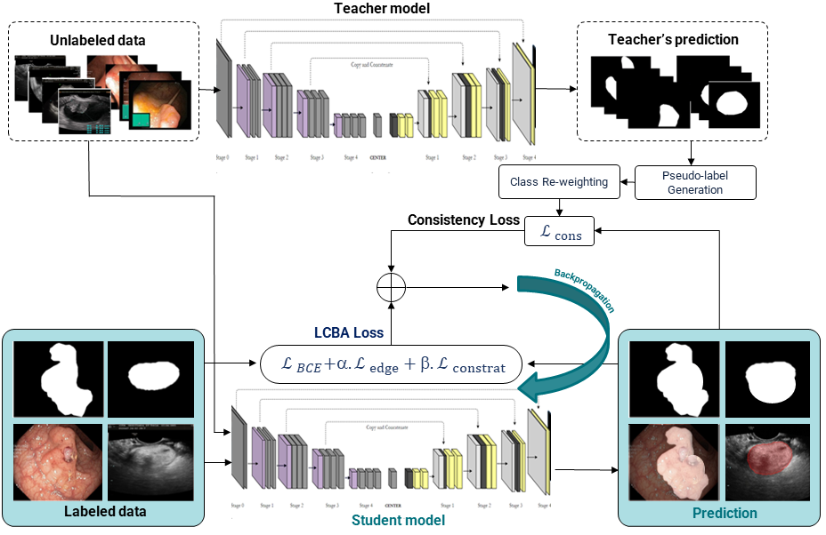
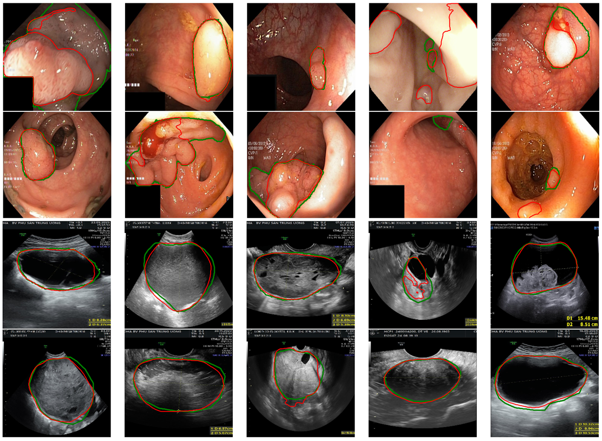

# LCBA-Seg: Low-Contrast and Boundary Aware Semi-Supervised Medical Image Segmentation

## 📌 Overview

Segmentation becomes particularly challenging in regions with **low contrast** and **ambiguous boundaries**, where pixel-level discrimination is difficult even for deep learning models.

To address this issue, we propose a semi-supervised learning framework called:

> **LCBA-Seg (Low-Contrast and Boundary-Aware Semi-Supervised Segmentation)**

This method leverages both **labeled and unlabeled data** to improve segmentation performance, especially in difficult boundary regions.

---

## 🎯 Key Idea

LCBA-Seg is designed to:

- Enhance segmentation in **low-contrast regions**
- Improve **boundary awareness**
- Utilize **unlabeled data effectively**
- Reduce overfitting in limited annotation scenarios

---

## 🧠 Method Overview

Our framework consists of three main components:

### 1. Supervised Branch
Learns from labeled data using standard segmentation loss.

### 2. Unsupervised Consistency Branch
Enforces consistency between predictions on unlabeled data under different augmentations.

### 3. Boundary-Aware Module (BAM)
Focuses explicitly on:
- Edge refinement
- Boundary sharpening
- Reducing ambiguous region errors

---

## 🧩 Architecture

---

## 🔍 Low-Contrast Challenge

In low-contrast regions, standard models often fail due to weak pixel intensity differences.

---

## 🧱 Boundary Ambiguity Problem

Ambiguous boundaries lead to:
- Over-segmentation
- Under-segmentation
- Class confusion

### Visualization:

---

## 🚀 Training Strategy

LCBA-Seg uses a semi-supervised learning pipeline:

1. Train on labeled data
2. Generate pseudo-labels for unlabeled data
3. Apply consistency regularization
4. Refine boundaries using BAM

---
# Dataset: https://drive.google.com/file/d/1jrW9qDTtcvRSCtGvcj46syLisGxrBCPs/view

## 📊 Loss Function

The total loss is defined as:

\mathcal{L}_{LCBA} = \mathcal{L}_{BCE} + \alpha \mathcal{L}_{edge} + \beta \mathcal{L}_{contrast}

---

## 📈 Expected Benefits

- Better performance in **low-contrast regions**
- Improved **boundary precision**
- Robustness with **limited annotations**
- Effective use of **unlabeled data**

---

## 📷 Results

### Qualitative Results

### Failure Case Reduction

---

## 📁 Project Structure
